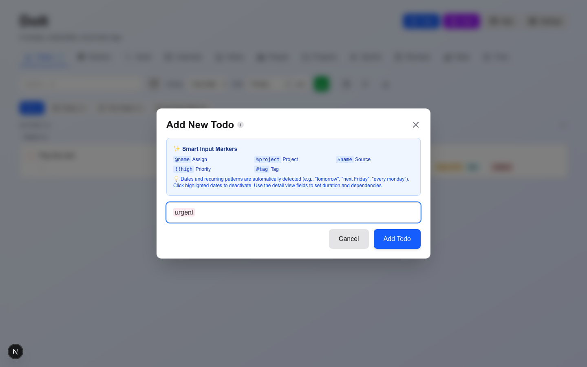
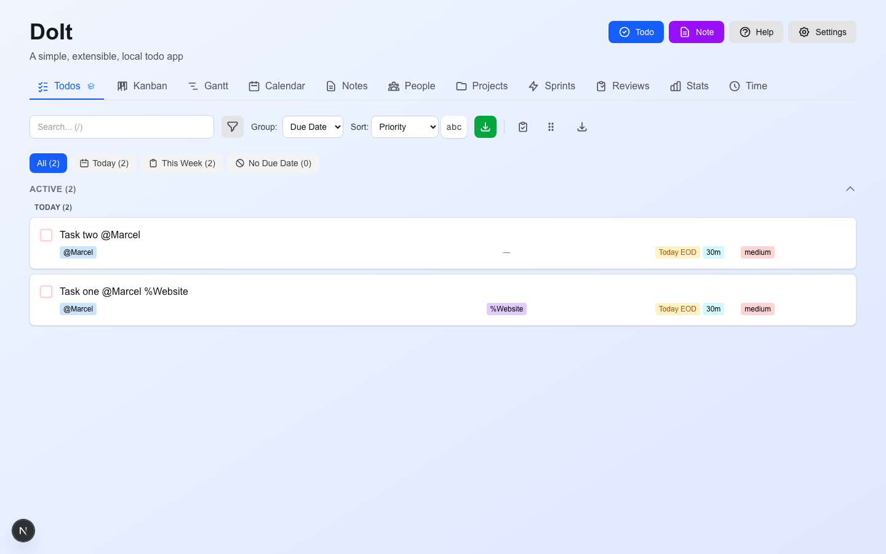

# Manual feature sweep — 2026-08-29

Hands-on test of the running app in a real browser, to find what works and what doesn't.

| | |
|---|---|
| Branch | `review-fixes-2026-08` @ `7bb2a15` (109 commits ahead of `main`; 331 files, +16,082 / −22,570) |
| App | `npm run dev` on port 3100, Chromium via the repo's own Playwright 1.57 |
| Method | Scripted real-browser interaction, fresh ephemeral profile per run; every assertion read back from the app's own IndexedDB store |
| Unit suite at time of test | **1,558 passed / 58 suites, green** |

**Why this was worth doing.** The unit suite is fully green and the E2E suite reports 93
passing tests, yet seven real defects were found in an afternoon — including one that silently
destroys user input. The reason is at the bottom of this report: a number of E2E assertions
cannot fail (§4).

---

## 1. Findings

| # | Severity | Area | Defect |
|---|---|---|---|
| F4 | **BLOCKER** | Add todo | Input fully consumed by the parsers is silently discarded |
| F2 | **HIGH** | Smart input | Bare priority keywords strip the word but set no priority |
| F6 | **HIGH** | People / Projects | Renaming orphans every todo that referenced the entity |
| F3 | **HIGH** | Smart input | `from <person>` is detected as *mentioned*, never as *source* |
| F5 | MEDIUM | Smart input | `every monday and wednesday` mangles text, drops the 2nd day |
| F1 | MEDIUM | Tutorial | Escape-dismissing the tour never persists |
| F7 | LOW | Shortcuts | `Shift+N` is advertised on the button but does nothing |

Every finding below was reproduced from a **clean profile** in a final confirmation pass.

---

### F4 — Input fully consumed by the parsers is silently discarded — BLOCKER

Type a task whose text is entirely eaten by auto-detection, press Add: the overlay closes,
**no todo is created, and nothing tells the user.** The text is gone.

**Reproduce** — fresh profile, type into the add-todo box and submit:

| Input | Todos created |
|---|---|
| `Payday` | 0 |
| `Someday` | 0 |
| `Monday` | 0 |
| `urgent` | 0 |
| `ASAP` | 0 |
| `tomorrow`, `2h`, `#tag`, `every day` | 0 |
| `Payday2 every 1st monday` (control) | 1 ✅ |
| `Pay the rent` (control) | 1 ✅ |

`Payday`, `Someday` and `Monday` are ordinary task titles — this is reachable in normal use,
not a synthetic edge case. The Add button stays **enabled** and the overlay **closes**, so the
interaction is indistinguishable from success.

**Cause**

- `src/components/views/TodoApp.tsx:723` — `if (currentPlainText.trim() === "") return;` bails silently.
- `src/components/views/TodoApp.tsx:1667-1669` — the form runs `setIsAddOverlayOpen(false)`
  **unconditionally** after calling `handleSubmit`, so the overlay closes even when nothing was created.
- Same shape on the Enter path, `src/components/views/TodoApp.tsx:1686-1688`.

**The fix pattern already exists in this codebase.** The Add Note dialog handles exactly this
case correctly: with a title of `urgent`, its `note-create-submit` button is **disabled**, so
the user gets feedback instead of silent loss. Applying the same guard to the todo dialog would
close this.

Compounding: F2 strips `urgent` from the text, so a task literally named "urgent" vanishes.



---

### F2 — Bare priority keywords strip the word but set no priority — HIGH

| Input | Text stored | Priority stored | Docs say |
|---|---|---|---|
| `This task is urgent` | `This task is` | `3` (Medium) | text unchanged, priority **Urgent** |
| `ASAP needed for deployment` | `needed for deployment` | `3` (Medium) | text unchanged, priority **Urgent** |
| `Set priority critical` (control) | `Set priority critical` ✅ | `1` ✅ | correct |

Both halves are wrong: the keyword is silently deleted from the user's text **and** the priority
it was supposed to set is not applied. Net effect is pure data loss.

`docs/source-priority-auto-detection.md:102-112` documents the detection;
`:165-172` explicitly lists auto-detected priorities under **"What Stays in Text"**.

The explicit `!!urgent` / `!!high` / `!!low` marker form works correctly (verified: priorities
1 / 2 / 4). Only the bare-keyword form is broken.

---

### F6 — Renaming a person or project orphans every todo that referenced it — HIGH

Todos reference people and projects **by name**, not by id
(`src/hooks/useTodos.ts:99-109`, comment: *"using names as IDs temporarily"*), and rename does
not rewrite those references.

**Reproduce**

1. Create person `Marcel`; add two todos `@Marcel`. People view shows **`Marcel 2 / 0`**.
2. Open the person, rename to `Marcel Erz`, save.
3. People store is now `["Marcel Erz"]`, but both todos still hold `assignedPeople: ["Marcel"]`.
4. The People row's count **disappears entirely** — the person now looks like they have no work.
5. The todos keep rendering a dangling `@Marcel` marker.

Projects behave identically: store renamed to `Website Redesign`, todo still references `Website`.

Silent, trivially reachable, and it degrades data rather than just display.



---

### F3 — `from <person>` is detected as *mentioned*, never as *source* — HIGH

With `Marcel` existing as a person:

```
Input:    Email from Marcel about the deadline
Actual:   mentionedPeople ["Marcel"],  sourcePeople []
Expected: sourcePeople ["Marcel"]      (docs/source-priority-auto-detection.md:45)
```

The project's own canonical example (`docs/source-priority-auto-detection.md:177`) expects
`Marcel` → mentioned and `John Doe` → **source**; the app produced no source at all.
Source auto-detection appears dead whenever the name is a known person. The explicit `$Name`
marker still works.

---

### F5 — Multi-day recurrence mangles the text and drops days — MEDIUM

| Input | Text stored | Recurrence stored |
|---|---|---|
| `Sync every monday and wednesday` | `Sync and` | `every monday` |
| `Task every monday, wednesday and friday` | `Task , and` | — |

Single-day forms are fine (`every monday`, `every last friday`, `every workday`,
`every month on the 15th`, `daily`/`weekly`/`biweekly` all parse correctly).

---

### F1 — Escape-dismissing the tutorial never persists — MEDIUM

Escape closes the 11-step tour but calls `onClose` only, so
`doit-tutorial-preferences` stays `null` and **the tour reopens on every single reload, forever**.
`src/components/overlays/TutorialOverlay.tsx:367-368`.

"Skip tutorial" and "Got it! Don't show again" both persist correctly — Escape, the most natural
dismissal, is the one that doesn't.

---

### F7 — `Shift+N` is advertised but does nothing — LOW

The Add Note button's tooltip reads **"Add new note (Shift+N)"**
(`src/components/views/TodoApp.tsx:824`), but the handler at
`src/components/views/TodoApp.tsx:612` tests `e.key === "n"` without excluding Shift. `Shift+N`
produces `"N"`, so it never matches. Lowercase `n` works (opens the *todo* dialog).

Note the neighbouring Help shortcut at `:689` does it correctly: `e.key === "?" && e.shiftKey`.

---

## 2. What works

Verified hands-on, each confirmed to persist across a reload where applicable.

- **All 11 views** render with **zero console and page errors** on seeded data.
- **Todo CRUD** — add, complete, archive, duplicate, delete, persistence, details overlay.
- **Undo** — completion/deletion undo works; bulk delete confirms with a 10s undo window.
- **Recurring** — completing `every monday` spawns exactly one next instance with the correct
  next due date, and **undo correctly removes the spawned instance**.
- **Smart input (working parts)** — `!!priority`, `#tags`, `%project`, `@person`, `$source`,
  bare-name mentions, `on <project>`; dates (`tomorrow`, `next friday at 3pm`,
  `in 3 business days`), shorthands (`eod`…`eoy`), fiscal (`Q1`, `FY26`), holidays, durations
  (`45m`, `2h`, `1.5h`, `2d`, `1w`), and all single-day recurrence forms.
  *Markers only link entities that already exist — they do not auto-create them.*
- **List view** — sort (asc/desc), all 7 groupings, quick-filter counts matching row counts,
  search, view presets (save → persist → re-apply restores sort), exports (Markdown/CSV/JSON
  all download non-empty, correct content).
- **Selection & bulk** — `role=checkbox` rows with correct `aria-checked`, "N selected",
  bulk Edit / Complete / Delete; batch edit applies to exactly the selected rows.
- **Details overlay** — subtasks (add / toggle / `1/2 (50%)` progress / delete), tags,
  dependencies, recurring, comments (stored with edit history), Save as Template.
- **Time tracking** — Start opens an entry and moves the card to in-progress; Stop closes it
  with a duration. (Stored under `timeTracking.entries`.)
- **Kanban** — drag Backlog → To Do → In Progress works; the backwards transition
  In Progress → Backlog is **correctly blocked** by the transition rules; dragging to Done sets
  `workflowState=completed` and completes the todo; persists across reload.
- **Calendar** — Month/Week/Agenda modes, next-month navigation, "Today" returns correctly.
- **Gantt** — all three scheduling techniques (Sequential/Pomodoro/Flow) apply without errors.
- **Notes** — create, rich-text content saved, bold stored as `<b>`, listing, pinning,
  Convert to Todo.
- **People / Projects / Sprints / Reviews** — creation and listing all work; reference counts
  render (until a rename, see F6).
- **Stats** — arithmetic verified against seeded data: UI "3 Active Tasks / 2 Completed"
  matched the real stored counts exactly.
- **Time Reports** — all 6 groupings render without errors.
- **Settings** — all **18 tabs** render with zero console/page errors. Feature flags work:
  disabling Kanban removes its tab, re-enabling restores it.
- **Backup / Storage** — manual backup creates entries; Storage reports the IndexedDB backend
  and usage. **Danger Zone is properly guarded**: "Clear All Data" expands an inline
  confirmation, the destructive button stays disabled until you type `DELETE ALL DATA` exactly,
  and it then wipes todos and notes as promised.
- **Keyboard** — digit view switching, `n`, `/` (focuses search), `Shift+?` (Help).
- **Mobile at 390px** — no horizontal page overflow; rows still render.
- **Theme** — Light/Dark applies and persists, though with a **~0.7–1.1 s lag** because
  `ThemeProvider` polls storage every 1000 ms instead of reacting to the change. A perceptible
  nit, not a defect.

---

## 3. Coverage

**Exercised:** cold start & tutorial; todo CRUD & persistence; the full smart-input parser
matrix (~70 inputs); list view sort/group/filter/search/presets/export/selection/batch/bulk;
details overlay (subtasks, tags, dependencies, recurring, comments, time tracking, templates);
Kanban drag-and-drop and transition rules; Calendar modes and navigation; Gantt techniques;
Notes CRUD, rich text and Convert to Todo; People/Projects CRUD and rename; Sprints and Reviews
creation; Stats arithmetic; Time Reports groupings; all 18 Settings tabs, feature flags, theme,
backup and the Danger Zone; keyboard shortcuts; mobile viewport.

**Not verified — stated plainly rather than implied:**

- **Focus mode / Open focus mode** — entered from Gantt, but I could not confirm the timer UI;
  an early "pass" turned out to be my assertion matching a Gantt timestamp, so it is recorded
  as unverified rather than working.
- **Note action items → todos** — the "Add action item…" field was not reliably present in the
  DOM across runs; not enough evidence to call it either way.
- **Manual time entry** (`+ Manual`) — control targeting drifted; not verified.
- **Import** — the tab and file input render; no file was actually imported.
- **Restore from backup** and **Switch storage backend** — not exercised (destructive/irreversible).
- Offline mode, service-worker update toast, PWA install, notifications, Gantt bar
  drag-rescheduling, WIP limits, custom Kanban board views, review edit/detail depth,
  search history, Categories/Priorities/Links/Markers/Auto-Assign settings *effects*.

**Environment note.** The MCP browser in this session produced no animation frames at all
(`requestAnimationFrame` never fired), which broke every frame-dependent action. That is a
harness limitation, not an app bug — the whole sweep was run on the repo's own Playwright
instead. An early "invisible tutorial card" observation was traced to this and discarded.

---

## 4. Why the automated suite didn't catch any of this

Verified directly against the tree:

- Specs query `[data-testid="X"]` for names the app **never defines as testids**:
  `sort-button`, `comment-input`, `mobile-menu`, and the `data-completed` attribute do not exist
  in `src/` at all. `settings-button` and `filter-button` exist only as `data-tutorial`
  attributes (`TodoApp.tsx:845`, `ListViewToolbar.tsx:201`).
- Those lookups sit inside `if (await x.isVisible().catch(() => false))` guards, so the steps
  pass **without asserting anything**. Sorting, filtering, comments, the entire `/settings`
  page and mobile navigation are effectively untested.
- `e2e/smoke/accessibility-keyboard.spec.ts:39` asserts `expect(isFocused || true).toBe(true)`
   — a tautology that cannot fail.
- `e2e/fixtures/todo-app.fixture.ts` counts completed todos via `[data-completed="true"]`, an
  attribute that does not exist, so `completedCount` is always `0`.
- The fixture assumes `@name` / `%project` implicitly create people and projects. They do not —
  markers only link pre-existing entities.

Sprints, Stats, Time Reports, Reviews and `/settings` have no real coverage at all, and commit
`145eb79` deleted 26 archived specs (~2,968 lines) covering undo/redo, dependencies,
backup-restore, settings, view presets, bulk operations and sorting/grouping without live
replacements.

---

## 5. Suggested order of work

1. **F4** — guard the add-todo submit the way the note dialog already does. Silent data loss.
2. **F6** — reference people/projects by id, or rewrite references on rename.
3. **F2** and **F3** — both are in the auto-detection layer and likely share a cause.
4. **F5**, **F1**, **F7** — small, self-contained.
5. Replace the hollow E2E assertions with ones that can fail; every defect above is cheap to
   pin with a regression test.
